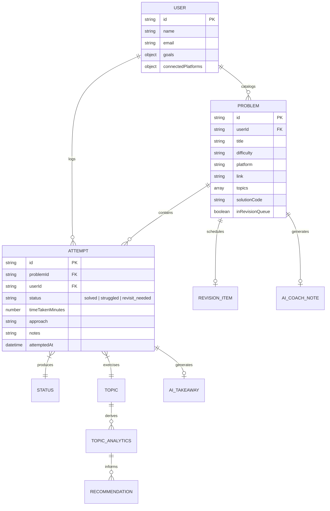
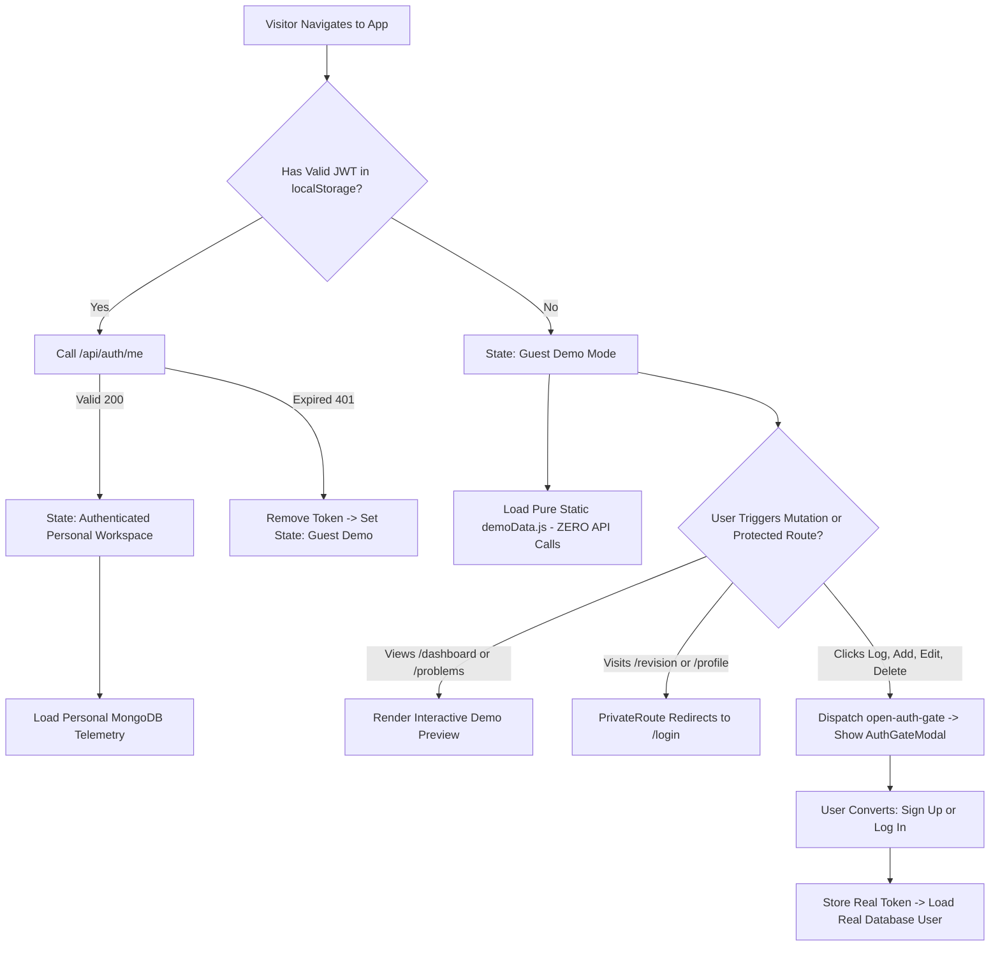
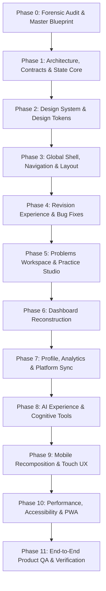

# MASTER PROJECT RECONSTRUCTION PLAN — DSA TRACKER
**From-Scratch Product + Architecture + UX + UI + Functionality Rebuild Blueprint**
*Generated from Forensic Repository Audit (Phase 0)*

---

## Executive Summary & Non-Negotiable Operational Baseline

This document is the authoritative, single-source-of-truth reconstruction blueprint for the **DSA Tracker**. It is based on a zero-assumption, forensic source-code and visual audit of the entire repository (commits `e451b86` through `d97021d`).

### The Core Problem Diagnosed
The repository has suffered from iterative feature patching and cosmetic redesigns without a unified underlying information architecture. Features overlap, contradict each other, expose metrics without decision-support value, and communicate via fragile window-level event buses. Out of 9 dashboard components, 5 are completely dead orphaned files (>100 KB of dead code). A fatal runtime ReferenceError crashes `/revision` for any user who is caught up, and critical KPI cards display hardcoded strings ("7 / 14 Patterns", "50% Complete") that contradict the real database state on the exact same screen.

### Non-Negotiable Operating Principles
1. **ONE System, ONE Mental Model:** The DSA Tracker is a serious developer learning workspace, NOT an admin template or collection of decorative widgets.
2. **First-Principles Practice Loop:** The entire product exists to serve:
   $$\text{DISCOVER} \longrightarrow \text{PRACTICE} \longrightarrow \text{LOG} \longrightarrow \text{RECALL} \longrightarrow \text{IMPROVE} \longrightarrow \text{REPEAT}$$
3. **Strict One-Phase-at-a-Time Execution:** No speculative multi-phase implementations. Each phase must be verified, reported, and approved before starting the next.
4. **Preserve Proven Checkpoints:** The guest demo workspace architecture and backend security model established in checkpoint `e451b86` are preserved and strengthened.

---

## 1. Product Vision & Principles

### Product Vision
A high-focus, distraction-free technical preparation workspace that combines problem tracking, deliberate practice execution, forgetting-curve spaced repetition, algorithmic gap analysis, and grounded AI coaching into one coherent engineering tool.

### Core Product Questions
Every view and interaction must immediately and decisively answer:
- **WHERE AM I?** — Real practice streak, active focus pattern, velocity, and readiness.
- **WHAT SHOULD I DO NOW?** — One clear, algorithmic daily mission based on active recall.
- **WHAT SHOULD I DO NEXT?** — The prioritized spaced repetition queue, ranked by urgency.
- **WHAT SHOULD I IMPROVE?** — Specific algorithmic bottlenecks (struggle ratio, topic gaps).
- **HOW AM I PROGRESSING?** — Grounded practice volume, consistency rhythm, and mastery milestones.

### Visual & Emotional Tone
- **Calm, Structured, Technical:** Inspired by the utilitarian precision of Linear, Raycast, and GitHub.
- **Dark-First Elegance:** Deep obsidian surfaces, subtle hairline borders, crisp typography (`Inter` & `JetBrains Mono`), and restrained semantic accents (Emerald for Solved, Amber for Struggled/Revision, Crimson for Hard).
- **Anti-Patterns Strictly Banned:** Neon gradients, decorative 3D widgets that serve no practice purpose, duplicate action buttons, and fake hardcoded metrics.

---

## 2. Forensic Audit Findings & Failure Modes

### 2.1 Critical Runtime Bugs & Data Contradictions Discovered
| Severity | Location | Issue Description | User Impact |
| :--- | :--- | :--- | :--- |
| **P0 (Fatal Crash)** | `client/src/pages/RevisionPage.jsx:510` | `<CheckCircle2 className="w-6 h-6" />` is rendered in caught-up empty state, but `CheckCircle2` is NOT imported from `lucide-react`. | The `/revision` page crashes with a fatal React ErrorBoundary whenever a user is caught up or queue is empty. |
| **P1 (Data Contradiction)** | `client/src/components/dashboard/UnifiedHero.jsx:240` | "7 / 14 Patterns" and "50% Complete" are hardcoded strings in the KPI dock. Directly below, `MasteryMilestonePath.jsx` computes 0% from real data. | Authenticated users see conflicting metrics on the exact same screen. |
| **P1 (Data Contradiction)** | Auth vs Dashboard vs Problems vs Hero | Login screen promises "35 preloaded problems"; Dashboard banner says "399 cataloged questions"; Hero card says "182 / 399"; Problems table lists 10 problems. | Severe product credibility failure for prospective and guest users. |
| **P2 (UI Defect)** | `client/src/pages/ProblemDetailPage.jsx:304` | Telemetry block renders `CATALOGED: Invalid Date` in demo mode. | Demo problem details look unfinished and broken. |
| **P2 (Visual Defect)** | `client/src/components/profile/ProfileHeader.jsx` | Avatar renders an empty black box when user has no avatar image instead of user initials. | Broken visual identity on profile page. |
| **P2 (Typography Truncation)** | `client/src/pages/ProblemsPage.jsx:82` | Problem title column is too narrow on 1440px desktop, truncating titles to 12 characters ("Longest...", "Minimum Windo..."). | Unusable problem catalog scanning experience. |

### 2.2 Dead Code & Orphaned Component Inventory
The audit identified over **100 KB and 2,300+ lines of dead, unimported code** sitting inside `client/src`:
1. `client/src/components/dashboard/IntelligentRecommender.jsx` (197 lines, 7.8 KB) — Orphaned.
2. `client/src/components/dashboard/PracticeStudio.jsx` (64 lines, 1.8 KB) — Orphaned.
3. `client/src/components/dashboard/TodaysFocusCard.jsx` (359 lines, 15.1 KB) — Orphaned (only imported by dead `PracticeStudio`).
4. `client/src/components/dashboard/PracticeStateBar.jsx` (252 lines, 12.6 KB) — Orphaned.
5. `client/src/components/dashboard/WeeklyReviewCard.jsx` (237 lines, 11.7 KB) — Orphaned.
6. `client/src/components/analytics/LeetCodeStatsConsole.jsx` (525 lines, 23.7 KB) — Orphaned.
7. `client/src/components/analytics/SolveTrendChart.jsx` (714 lines, 28.5 KB) — Orphaned.

### 2.3 Architectural Anti-Patterns
- **Window Event Bus Addiction:** Cross-page synchronization relies on `window.dispatchEvent(new CustomEvent('problem-created'))`. When an attempt is logged, up to 7 uncached GET requests fire simultaneously across mounted components.
- **Monolithic File Bloat:** `ProblemsPage.jsx` (1,113 lines), `ProblemDetailPage.jsx` (980 lines), `AppShell.jsx` (1,069 lines), and `PlatformSyncHub.jsx` (1,142 lines) each bundle page orchestration, data fetching, filtering, modal state, and raw UI rendering in single massive files.
- **Duplicate CTAs:** Every page has 2–3 competing "Add Problem" or "New Problem" buttons competing for visual priority.

---

## 3. Data Relationships & Practice Loop Model

### 3.1 Practice Loop Entity Relationship


### 3.2 Spaced Repetition Derivation Rules
The spaced repetition schedule is calculated deterministically via `server/src/utils/revisionRules.js`:
- $\text{Intervals}: \text{solved} = 14\text{ days}, \text{revisit\_needed} = 5\text{ days}, \text{struggled} = 2\text{ days}$
- $\text{Struggle Weights}: \text{solved} = 0, \text{revisit\_needed} = 1, \text{struggled} = 2$
- $\text{Effective Days}: \text{solved is clamped to } \min(\text{daysElapsed}, 30); \text{ struggling is unclamped.}$
- $\text{PriorityScore} = \left(\frac{\text{Effective Days}}{\text{Interval}}\right) + \text{Weight}$

---

## 4. Keep / Remove / Merge Decisions

| Component / Feature | Decision | Rationale |
| :--- | :--- | :--- |
| `IntelligentRecommender.jsx` | **REMOVE** | Dead orphaned file. Logic handled by backend `/api/problems/recommendations`. |
| `PracticeStudio.jsx` & `TodaysFocusCard.jsx` | **REMOVE** | Dead orphaned files replaced by dashboard Today's Mission dock. |
| `PracticeStateBar.jsx` | **REMOVE** | Dead orphaned file replaced by UnifiedHero KPI dock. |
| `WeeklyReviewCard.jsx` | **MERGE** | Dead in dashboard; revive as a clean drawer or profile insight widget. |
| `LeetCodeStatsConsole.jsx` | **REMOVE** | Dead orphaned file; platform metrics belong strictly in `PlatformSyncHub`. |
| `SolveTrendChart.jsx` | **REMOVE** | Dead orphaned file; heatmap and 7-day velocity provide superior decision signal. |
| `MasteryMilestonePath.jsx` | **RESTRUCTURE** | Current 29 KB skill tree dominates dashboard canvas. Move to dedicated Roadmap view or compact secondary drawer. |
| `UnifiedHero.jsx` | **REBUILD** | Eliminate hardcoded strings; wire directly to verified API contracts. |
| `AppShell.jsx` | **RESTRUCTURE** | Split into modular components: `Sidebar`, `Topbar`, `MobileNav`, `UserMenu`. |
| `CommandPalette.jsx` | **KEEP & REFINE** | High-utility navigation tool; unify with global search index. |
| `PlatformSyncHub.jsx` | **RESTRUCTURE** | Decompose 1,142-line monolith into platform-specific adapter cards. |
| `demoData.js` | **STANDARDIZE** | Synchronize problem counts (e.g. standard 25 realistic problems across all surfaces). |

---

## 5. Master Information Architecture & Route Contracts

### 5.1 Route Hierarchy
```
/
├── /dashboard              [Hybrid Workspace: Guest Demo or Personal Authenticated]
│   ├── KPI Dock (Solved, Streak, Due Recall, Velocity)
│   ├── Today's Mission (Top Priority Algorithmic Target)
│   ├── Spaced Recall Rail (Next due items with 1-click log)
│   └── Algorithmic Weakness Drill (Struggle distribution & heatmap)
│
├── /problems               [Hybrid Workspace: Catalog & Search]
│   ├── High-Density Problem Table (Full-bleed, clean columns, sorting)
│   ├── Filter & Search Bar (Query, Topic, Difficulty, Platform, Status)
│   └── Detail Drawer / Page Link
│
├── /problems/:id           [Hybrid Workspace: Practice Studio]
│   ├── Problem Header & Direct External Platform Link
│   ├── Integrated Stopwatch / Interval Practice Timer
│   ├── Solution Code & Complexity Analysis
│   ├── Practice Attempt History
│   └── Grounded AI Cognitive Coaching / Takeaway
│
├── /revision               [Strictly Protected: Spaced Repetition Command]
│   ├── Urgency-Ranked Recall Queue
│   ├── Forgetting Curve Math Inspector
│   └── Batch & Rapid Practice Loggers
│
├── /profile                [Strictly Protected: Engineering Passport]
│   ├── Overview & Target Goals (Interview target, daily velocity)
│   ├── Platform Integrations (LeetCode, CF, GFG, CodeChef live sync)
│   ├── Milestones & Mastery Badges
│   ├── Practice Activity (Full 52-week heatmap & time distribution)
│   └── Account & Security Settings
│
├── /login                  [Public Only: Streamlined Gateway]
├── /signup                 [Public Only: Fast Onboarding]
└── *                       [Clean 404 Recovery Screen]
```

### 5.2 Navigation Priority Matrix
- **PRIMARY:** Dashboard (Daily Command), Problems (Catalog & Search), Revision (Active Recall).
- **SECONDARY:** Profile & Analytics, Platform Sync.
- **ACTION:** Log Attempt, Add Problem, Launch Practice Timer, AI Hint.
- **SYSTEM:** Settings, Account Security, Export/Import, Logout.

---

## 6. Authentication & Guest Security Architecture



---

## 7. Master Reconstruction Phases (Dependency-Driven)



### Phase Breakdown & Deliverables

#### PHASE 1: Data Contracts, State Architecture & Dead Code Removal
- **Goal:** Establish rock-solid data synchronization, eliminate window-level event bus spaghetti, remove all 7 dead orphaned files, and synchronize demo data contracts.
- **Dependencies:** None (Baseline audit complete).
- **Why First:** UI reconstruction cannot build on shifting data models or dead code bloat.

#### PHASE 2: Design System Foundations & Typography Refinement
- **Goal:** Unify color tokens, elevation tiers, border radii (4px/8px), typography hierarchy (`Inter Variable` and `JetBrains Mono`), semantic state badges, and button primitives.
- **Dependencies:** Phase 1.
- **Why Before Shell:** The global navigation shell requires consistent button, badge, and input primitives.

#### PHASE 3: App Shell, Topbar, Sidebar & Global Navigation
- **Goal:** Reconstruct `AppShell.jsx` into modular units: `AppSidebar`, `AppTopbar`, `MobileTabBar`, `UserDropdownMenu`. Remove hardcoded track fillers and fix duplicate search bars.
- **Dependencies:** Phase 2.

#### PHASE 4: Revision Queue & Active Recall Experience
- **Goal:** Fix the fatal `CheckCircle2` crash, build the high-density spaced repetition table, urgency indicators, and rapid recall loggers.
- **Dependencies:** Phase 3.
- **Why Before Dashboard:** The Dashboard's core "Recall Queue" dock directly links to and mirrors this experience.

#### PHASE 5: Problems Catalog & Practice Detail Studio
- **Goal:** Rebuild `ProblemsPage.jsx` into high-density scannable table with proper title widths; decompose `ProblemDetailPage.jsx` to unite the Practice Timer, Code Viewer, and Attempt History. Fix `Invalid Date` bug.
- **Dependencies:** Phase 3.

#### PHASE 6: Dashboard Reconstruction (The Developer Command Center)
- **Goal:** Complete from-scratch rebuild of `DashboardPage.jsx`. Eliminate hardcoded numbers in `UnifiedHero`, replace monolithic skill tree with breathable workflow, elevate Spaced Repetition and Topic Gaps above the fold.
- **Dependencies:** Phases 4 & 5.

#### PHASE 7: Profile, Analytics & Platform Sync Hub
- **Goal:** Decompose `PlatformSyncHub.jsx`, fix empty avatar box in `ProfileHeader.jsx`, unify 52-week heatmap, and streamline interview readiness goals.
- **Dependencies:** Phase 6.

#### PHASE 8: Grounded AI Intelligence & Coaching Layer
- **Goal:** Integrate AI Hint Coaching, Post-Attempt Takeaways, and Weekly Strategy Brief into intuitive contextual drawers rather than disconnected widgets.
- **Dependencies:** Phase 5 & 6.

#### PHASE 9: Mobile Recomposition & Responsive Touch Polish
- **Goal:** Perfect the 375px, 430px, and 768px viewports. Implement true mobile sheet patterns, eliminate horizontal scrolling, and optimize touch targets for on-the-go practice.
- **Dependencies:** Phases 4–8.

#### PHASE 10: Performance, Accessibility & PWA Hardening
- **Goal:** Full WCAG 2.1 AA keyboard navigation, ARIA landmarks, contrast audits, bundle optimization, and offline PWA caching validation.
- **Dependencies:** Phase 9.

#### PHASE 11: End-to-End QA, Production Benchmarks & Final Checkpoint
- **Goal:** Full automated test suite run, headless browser regression passes across all viewports, latency benchmarks, and final stable commit checkpoint.
- **Dependencies:** Phases 1–10.

---

## 8. Risk Register & Mitigation Strategy

| Risk | Severity | Probability | Mitigation Strategy |
| :--- | :--- | :--- | :--- |
| **Breaking Guest/Auth Boundary** | High | Low | Strictly preserve `e451b86` architecture; run automated auth transition tests (`verify_phase_auth1_1_transitions.js`) at every checkpoint. |
| **Spaced Repetition Rank Inversion** | High | Low | Preserve `server/src/utils/revisionRules.js` mathematical formulas untouched; validate with unit test suite. |
| **API Contract Drift** | Medium | Medium | Maintain complete backward compatibility in Express route responses; zero database schema mutations without dedicated scripts. |
| **CSS Leakage / Style Regressions** | Medium | Medium | Use strictly scoped Tailwind utility classes; audit CSS variable tokens at design system phase. |
| **Mobile Layout Breakage** | Medium | Medium | Test all 6 standard viewports (1440, 1280, 1024, 768, 430, 375) using automated Puppeteer scripts before finalizing any screen. |

---

## 9. Rollback & Git Checkpoint Strategy

1. **One Logical Phase = One Semantic Checkpoint:** Commits must adhere to conventional format: `feat(phase-N): ...` or `refactor(phase-N): ...`.
2. **Pre-Commit Verification Gates:**
   ```bash
   npm test --prefix server
   npm run build --prefix client
   git status
   git diff --check
   ```
3. **Zero Dirty Commits:** Never commit temporary screenshot scripts, node scratch files, or test session artifacts.
4. **Instant Rollback Target:** If any phase introduces unresolvable regressions, cleanly roll back to the previous phase checkpoint using `git reset --hard <CHECKPOINT_HASH>`.

---

## 10. Recommended First Implementation Phase

### **PHASE 1 — DATA CONTRACTS, STATE ARCHITECTURE & DEAD CODE PURGE**
- **Objective:** Surgically eliminate all 7 identified dead orphaned components (>100 KB), fix the fatal `CheckCircle2` crash on `/revision`, standardize `demoData.js` counts across all surfaces, and establish a clean, predictable state sync layer.
- **Expected Outcome:** Clean build, zero runtime crashes, unified data metrics, and a stable foundation for the design system and shell reconstruction.
